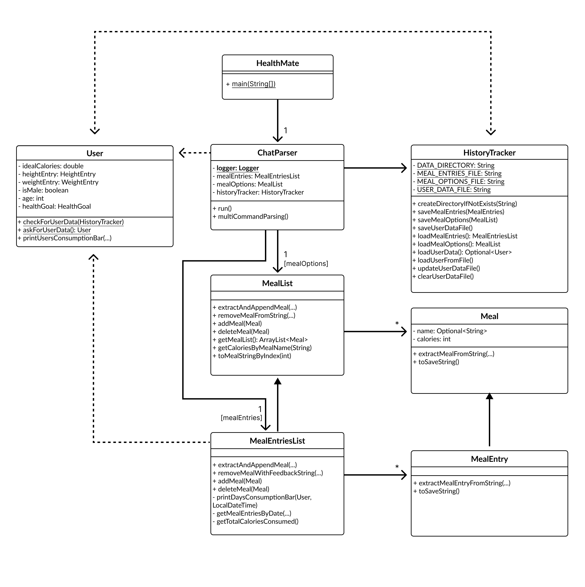
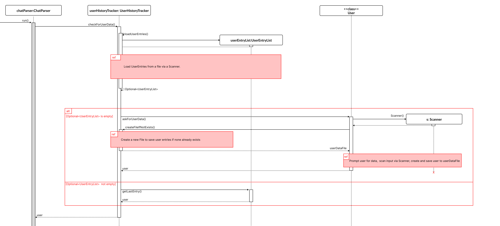

# Developer Guide

## Acknowledgements
ChatParser structure inspired by: 
[this repository](https://github.com/kennethSty/ip)
Calorie consumption bar inspired by 
[this blogpost](https://medium.com/javarevisited/how-to-display-progressbar-on-the-standard-console-using-java-18f01d52b30e)

## Design & implementation
### High Level Class Design
The main classes of this implementation are the following:
- HealthMate
- ChatParser
- User
- MealList
- MealEntriesList
- Meal
- MealEntry
- HistoryTracker
- UI
The following diagram illustrates their associations, methods and attributes.

#### HealthMate
Entry point to the application is the main function of HealthMate.
The HealthMate class contains a private ChatParser attribute. This attribute's run function initiates, 
after an initial greeting to the user, the interaction process. In this process, 
the user enters commands with additional information into his command line application.
The content of these commands is parsed by the ChatParser. 

#### ChatParser
The ChatParser class, which is instantiated exactly once, manages the overall usage flow via its run() method. 
It contains a MealEntriesList object called MealEntries as well as a MealList object called mealOptions.
Thereby MealEntries contain tracked calorie consumptions. mealOptions tracks possible meals that are presaved by the 
user in order to quickly select from a list of meals for which the calories of a portion are already saved. 
Therefore, mealEntries and mealOptions are the primary objects with which the user interacts through his command line. 
The ChatParser class orchestrates the effects of the users command line prompts, ensuring no unintended changes are done.
Thereby, we distinguish between basic command prompts such as "bye" which are handled directly within run() and more
sophisticated commands that require several tokens and are therefore abstracted into the multiCommandParsing() method,
which is called within the run() method. 
To save the changes temporarily the ChatParser object also has a HistoryTracker object which facilitates the process of 
storing User data, mealEntries data and mealOptions data to their corresponding files. Besides storing data, 
loading existing data from the files, once another usage session is initiated is conducted by the HistoryTracker as well.

#### MealList
The MealList class contains a private ArrayList of Meal object.
Further, it encapsulates behaviour to operate on this list of meals. Most notably, 
this adding or deleting a Meal to/from the list. 

#### MealEntriesList
The MealEntriesList class extends the MealList class. It overwrites the extractAndAppendMeal(...) method,
and additionally includes methods specifically tailored to providing helpul user feedback, as the MealEntries stored 
within its instance, signify the users calorie consumption. 
As a MealEntry object differs from a Meal object by the additional timestamp attribute, this includes
computations based on the time dimension. More specifically, the printDaysConsumptionBar() uses the UIs class'
methods in the background to visualize the percentage of a certain days total consumption versus the idaeal consumption
of a User class. 

#### Meal
The Meal class encapsulates the concept of a meal. As the purpose of this application 
is to track calorie consumption, this consists of a mandatory calorie entry. The meal's name attribute, 
is however an Optional<String> allowing a case, where no meaningful label can be attached to a certain consumption.

#### MealEntry
The MealEntry class extends the meal class and contains an additional field timestamp. 
This distinction was made, as objects of the Meal class will represent possible meal options to choose form, 
while a mealEntry is a concrete calorie consumption the user wants to track. The latter makes a timestamp indispensible. 

#### User
Placeholder for user class. 

The following diagram visualizes the process of creating or loading a User object.

#### HistoryTracker
The HistoryTracker class is responsible for managing the persistence of data in the HealthMate application. It handles the saving and loading of user data, meal entries, and meal options to and from files. This class plays a crucial role in maintaining the application's state across different sessions.

Key features of the HistoryTracker class include:

1. Data Persistence:
   - Saves user data, meal entries, and meal options to separate files.
   - Loads existing data from these files when a new usage session is initiated.

2. File Management:
   - Creates and manages the necessary files for storing application data.
   - Handles file I/O operations, ensuring data integrity during read and write processes.

3. Data Formatting:
   - Converts complex objects (like User, MealEntry, and Meal) into a format suitable for file storage.
   - Deserializes stored data back into usable objects when loading the application state.

HistoryTracker allows for the persistance of user inputted data between sessions by storing it in a local csv file.

## Features

This section will document the contributions made by each team member regarding the implementation or planned feature enhancements, detailing the design and thought processes behind them.

---

### Command Handling with CommandMap Class

#### Overview

The `CommandMap` feature enhances the system's command handling by centralizing the lookup, and
storage of commands. It allows users to efficiently view commands usage within the HealthMate application.

#### Feature Implementation

The `CommandMap` class in the `seedu.healthmate.command` package maps command names to their corresponding
`Command` objects using a `HashMap<String, Command>`. This ensures fast retrieval and allows users to explore
commands with ease.

#### Why It Is Implemented This Way

Using a `HashMap` allows efficient command lookups with a constant time complexity of O(1). Centralizing all
commands within `CommandMap` simplifies the system's command handling process and makes it more maintainable  as new
commands are added.

#### Alternatives Considered

An alternative was storing commands in a list and iterating through them sequentially to find the matching command.
However, this approach was less efficient for frequent lookups compared to the `HashMap`.

#### Proposed additions for v2.1

The `CommandMap` can be built upon to support saving and usage of user created scripts as commands. For example
using a user could possibly create an add morningRoutine command by creating a command that runs multiple add
mealEntry commands of their regular breakfast as well as triggering the updateUser data command.

#### Sequence Diagram TBD

1. **Command Lookup Process**: Illustrate the flow from when a user enters a command to when `CommandMap.
getCommandByName()` retrieves the command and the UI displays the results.
   - Components: `UI`, `ChatParser`, `CommandMap`, `Command`.
   - Highlight how `CommandMap` retrieves the appropriate command based on user input.

---

## Product scope
### Target user profile

The target user profile for HealthMate includes:
- Health-conscious individuals who want to monitor their daily calorie intake
- People trying to lose weight or maintain a healthy weight
- Fitness enthusiasts who want to balance their calorie consumption with their exercise routines
- Individuals with specific dietary requirements or restrictions
- Anyone interested in developing better eating habits and nutritional awareness

### Value proposition

HealthMate solves the following problems:
- Difficulty in tracking daily calorie intake: Users can easily log their meals and snacks
- Lack of awareness about calorie consumption: The app provides visual representations of daily intake
- Inconvenience of manual calorie calculations: Pre-saved meal options make tracking quicker and more efficient
- Inability to see patterns in eating habits: Historical data allows users to analyze their consumption over time
- Struggle to maintain consistent healthy eating habits: Regular tracking encourages mindful eating and helps users stay accountable to their health goals

## User Stories

|Version| As a ... | I want to ... | So that I can ...|
|--------|----------|---------------|------------------|
|v1.0|new user|see usage instructions|refer to them when I forget how to use the application|
|v2.0|user|find a to-do item by name|locate a to-do without having to go through the entire list|

## Non-Functional Requirements

1. Usability: The command-line interface should be intuitive and easy to use, even for non-technical users.
2. Reliability: The application should not lose any user data during normal operation or unexpected shutdowns.
3. Compatibility: The application should run on common operating systems (Windows, macOS, Linux).
4. Maintainability: The code should be well-documented and follow clean code principles for easy future enhancements.
5. Portability: User data should be easily exportable and importable for backup purposes or switching devices.

## Glossary

* *Meal* - A food item or combination of food items consumed at one time, with associated calorie information.
* *MealEntry* - A record of a meal consumed by the user, including the meal details and a timestamp.
* *MealList* - A collection of pre-saved meals that users can quickly select from when logging their food intake.
* *MealEntriesList* - A chronological list of all meals consumed by the user.
* *ChatParser* - The component responsible for interpreting user commands and executing the appropriate actions.
* *HistoryTracker* - The component that manages the storage and retrieval of user data, meal entries, and meal options.

## Instructions for manual testing

1. Installation and Setup:
   - Ensure Java Runtime Environment (JRE) is installed on your system.
   - Download the HealthMate application JAR file.
   - Open a terminal or command prompt and navigate to the directory containing the JAR file.

2. Running the Application:
   - Execute the command: `java -jar HealthMate.jar`
   - Verify that the application starts and displays a welcome message.

3. Testing Basic Commands:
   - Try entering the command `help` and verify that usage instructions are displayed.
   - Test the `bye` command to ensure the application exits properly.

4. Adding a Meal:
   - Use the command `add mealEntry [name] [calories]` (e.g., `add meal "Chicken Salad" 350`)
   - Verify that the meal is added successf ully and displayed in the meal list.

5. Logging a Meal Entry:
   - Use the command `log meal [name/index] [portion]` (e.g., `log meal "Chicken Salad" 1`)
   - Check that the meal entry is recorded with the current timestamp.

6. Testing Data Persistence:
   - Exit the application using the `bye` command.
   - Restart the application and check if previously added meals and logged entries are still present.

7. Error Handling:
   - Try entering invalid commands or data to ensure the application handles errors gracefully and provides helpful error messages.